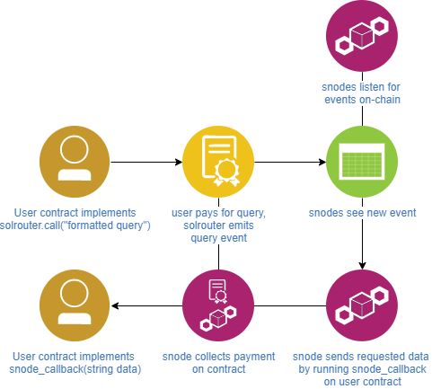

## SOLROUTER

snode operated oracle

This system trusts snodes to return api data, and allows users to pay snodes for the service.

A user contract that wants to query snodes for api data implements the necessary functions - solrouter.call() with the correctly formatted query which is sent to solrouter, and snode_callback() which allows the snodes to send data back into the user contract.

Solrouter emits an event when a query is made, which the snodes can look for in each new block confirmed on the chain. After a sufficient amount of confirmations on that block, an snode will callback the user contract with the requested data.

As of now there is no proof system in place that guarantees what is sent into the contract is what the api really returned, this system simply trusts the snodes to be good actors. As such there is a strict registration system for snodes requiring Nomination by another snode and then Registration by the snode in question.
A proof system requires case-by-case implementation of proof standards integrated by data providers and utilized by the snodes.

## solrouter methods:  

nominateSnode(address newSnode, uint32 myID)
 - A currently registered snode sends a new address to nominate and the snode's own ID (snodes must keep track of their own ID)

registerSnode()
 - A nominated snode accepts registration by running this function from the nominated address

query(string memory request) 
 - A user contract calls this function to make an arbitrary request, and must pay the requestPrice to the solrouter contract at this time (tracked by  mapping(address => uint256) payments;)
This is a general request, other kinds of requests may be implemented by creating other query(newType) functions

callback(uint32 snodeID, uint64 requestID, string memory requestReturn)
 - An snode runs this function to send data back to the user contract and collect payment

withdraw()
 - An snode takes their accumulated payments out of the contract into their address

## solrouter user methods:
A user contract must implement these methods in order to receive data from solrouter

address payable public solrouterAddress;
 - A user tracks the official solrouterAddress

function () {
	solrouterAddress.call.value(msg.value)(abi.encodeWithSignature("query(string)", "requestString"));
}
 - The user creates some function that includes a call to solrouter with the "requestString" they want and the necessary .value payment

function snode_callback(string memory data) {
	require(msg.sender == solrouterAddress, "Invalid data provider");
        ethbtc = data;
}
 - A user contract provides a function specifically named "snode_callback(string memory data)" so that solrouter can call this function to provide the requested data. The user adds the requirement that the callback can only come from the official solrouter address to prevent anyone else from providing the data.

## To Migrate:
1. Run: `truffle develop` under the application root
2. In the development console run: `compile`
3. Next run: `migrate` or (`migrate --reset`)

## To Test:
1. Migrate the contracts in the truffle development blockchain
2. `truffle test` or `test` in the truffle development console 
